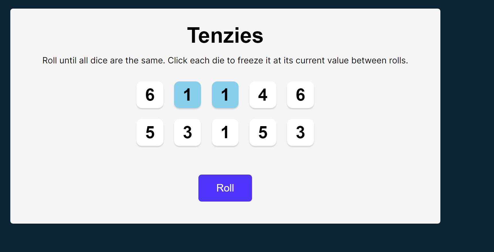

Certainly! Here's the updated readme with the added screenshot section:

# Tenzies

Tenzies is a dice game where the objective is to make all the numbers on the dice the same. Once you achieve this, you win the game!

### Screenshot 



## Features

- **Responsive Design**: The game is built with a responsive design, allowing it to adapt to different screen sizes and devices. Whether you're playing on a desktop, tablet, or mobile phone, the game will adjust accordingly for the best user experience.

- **Smooth Gameplay**: The game offers a smooth and seamless gameplay experience. The dice rolls and animations are fluid, providing an engaging and enjoyable gaming session.

- **Easy to Play**: Tenzies is designed to be easy to play and understand. The rules are simple, and the user interface is intuitive. Players of all ages and experience levels can quickly grasp the gameplay mechanics and start having fun.

- **Local Development**: To run the game locally on your machine, follow these steps:

  - Step 1: Fork this repository or clone it to your local machine.
  - Step 2: Navigate to the directory where the game is located (`C:\Users\Admin\Desktop\Tenzies` in this case).
  - Step 3: Open your terminal and run the following command to install the dependencies:
    ```
    npm install
    ```
  - Step 4: To start the game, run the following command:
    ```
    npm run dev
    ```

Enjoy playing Tenzies and have fun achieving the goal of making all the numbers the same!
